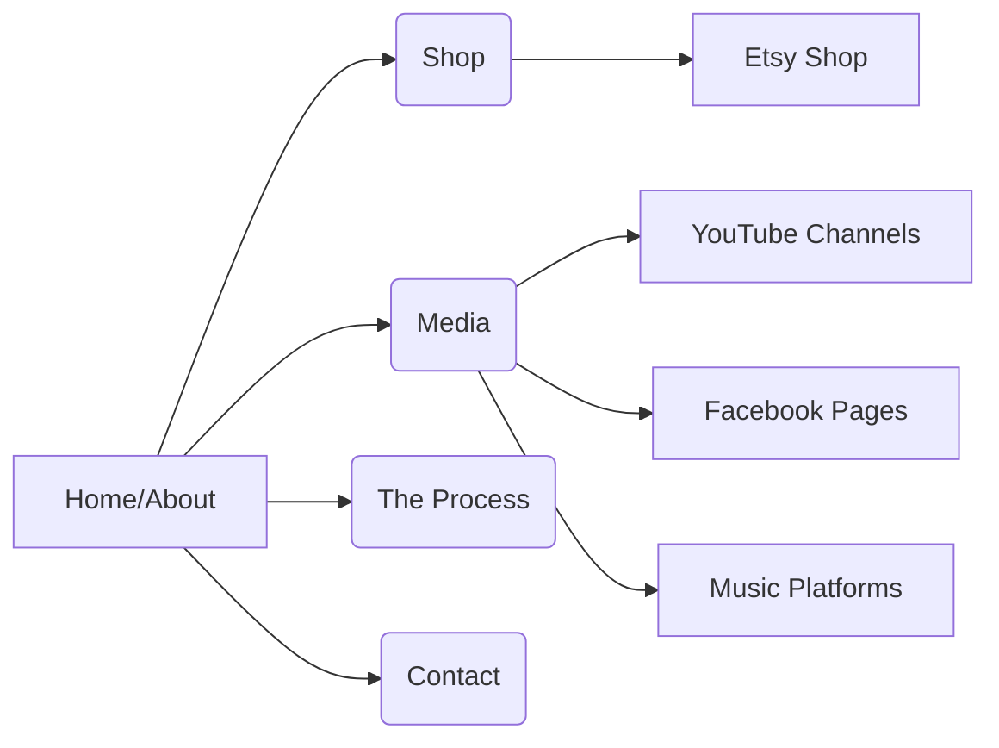

# Website Plan: Artificial Ryan

## I. Overall Design and Structure:

*   **Clean and Modern Design:** The website will have a clean and modern design that reflects the blend of technology and artistry.
*   **Color Palette:** The color palette will be based on the colors used in the logo image to maintain brand consistency.
*   **Mobile-Responsive:** The website will be fully mobile-responsive to ensure a user-friendly experience on all devices.
*   **Navigation:** The website will have a clear and intuitive navigation menu that allows visitors to easily access different sections.

## II. Content and Sections:

1.  **Home/About:**
    *   **Introduction:** Introduce Artificial Ryan, Ryan Harp, and the collaborative process with AI.
    *   **Mission Statement:** Highlight the brand essence and mission as a "digital forge of whimsy and utility" and an "experiment in collaborative creativity."
    *   **Visuals:** Use high-quality images of the products and Ryan Harp.
2.  **Shop:**
    *   **Etsy Shop Embedding:** Embed the Artificial Ryan Etsy shop using the existing iframe code on the current "shop" page.
    *   **Iframe Adjustment:** Adjust the size of the iframe to match the website's layout more fluidly.
3.  **Media:**
    *   **YouTube Channels:** Provide links to the Artificial Ryan Main YouTube channel and the Artificial Ryan Music YouTube channel.
    *   **Facebook Pages:** List and link to all the Artificial Ryan Facebook pages, with brief descriptions of their content.
    *   **Music Platforms:** Include links to Ryan's music on Soundcloud, Suno AI, and Riffusion.
4.  **The Process (Optional):**
    *   **Explanation:** Briefly explain the AI-assisted design and human refinement process.
    *   **Visuals:** Include images or videos showcasing the process.
5.  **Contact (Optional):**
    *   **Contact Form:** Provide a way for visitors to contact Artificial Ryan.

## III. Implementation Details:

*   **HTML Structure:** Use semantic HTML5 elements to structure the content.
*   **CSS Styling:** Use CSS to style the website and create a visually appealing design.
*   **JavaScript (Optional):** Use JavaScript to add interactivity and enhance the user experience.
*   **GitHub Pages Hosting:** Ensure the website is compatible with GitHub Pages hosting.

## IV. Mermaid Diagram:



## V. File Structure:

```
Artificial-Ryan.github.io/
├── index.html
├── about.html
├── shop.html
├── media.html
├── contact.html
├── css/
│   └── styles.css
├── js/
│   └── main.js
├── images/
│   └── Logo.png
├── header.html
└── footer.html
```

## VI. Next Steps:

1.  Review the Plan: Review the plan with the user and get their feedback.
2.  Implement the Design: Implement the design based on the plan and the user's feedback.
3.  Test the Website: Test the website on different devices and browsers to ensure it is working correctly.
4.  Deploy the Website: Deploy the website to GitHub Pages.